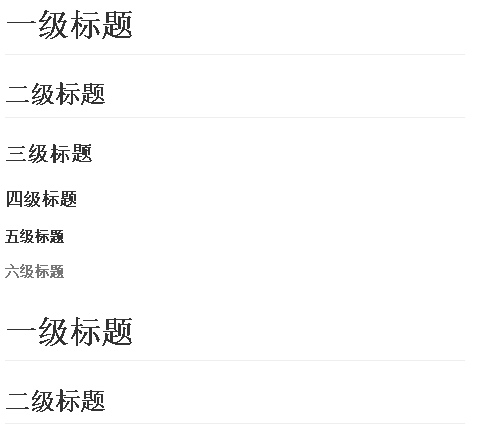
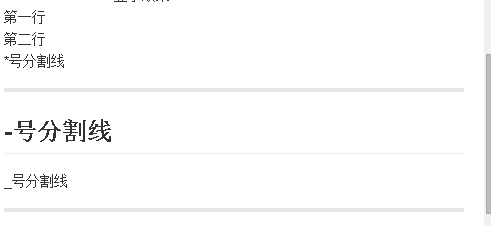

# Markdown语法格式
## 一、标题
<font color=red>语法格式：</font>   
```markdown
# 一级标题
## 二级标题
### 三级标题
#### 四级标题
##### 五级标题
###### 六级标题
一级标题
===========  
二级标题
-----------
```
<font color=blue>显示效果：</font>  
<不同的主题样式可能显示效果有所不同>   
<!--more-->
  
<span id="biaoti">测试锚点跳转</span>  


##  二、段落
<font color=red>语法格式：</font>  
```markdaown
换行：两个连续的空格后回车
分割线：连续三个以上的*号、-号或_号
第一行  
第二行  
\*号分割线  
**********
\-号分割线  
----------
\_号分割线  
__________
```
<font color=blue>显示效果：</font>  
<不同的主题样式可能显示效果有所不同>   
  
  
  
##  三、字体
<font color=red>语法格式：</font>  
```markdaown
*斜体*  
_斜体_  
**粗体**  
***加粗斜体***  
~~删除线~~
`高亮`
```
<font color=blue>显示效果：</font>  
*斜体*  
_斜体_  
**粗体**  
***加粗斜体***  
~~删除线~~
`这是高亮的文本`  

##  四、列表
<font color=red>语法格式：</font>  
```markdaown
 无序列表：
     第一种以*号标识
     * 项目一
     * 项目二
     * 项目三  
     第二种以+号标识
     + 项目一
     + 项目二
     + 项目三 
     第三种以-号标识
     - 项目一
     - 项目二
     - 项目三
 有序列表:  
    1. 项目一
    2. 项目二
    3. 项目三  
 定义型列表：  
    自定义列表名:    内容  
    列表名英文冒号:    TAB加内容  
```
<font color=blue>显示效果：</font>  
无序列表：  
     第一种以\*号标识
* 项目一
* 项目二
* 项目三    
     第二种以\+号标识
+ 项目一
+ 项目二
+ 项目三   
     第三种以\-号标识
- 项目一
- 项目二
- 项目三  
有序列表:  
1. 项目一
2. 项目二
3. 项目三  
定义型列表：  
自定义列表名:    内容  
列表名英文冒号:    TAB加内容   

##   五、超链接
<font color=red>语法格式：</font>  
```markdaown
内联：[链接文字](链接地址 "链接标题相当于alt")
eg： [Hexo](https://hexo.io/ "Hexo标题")  
引用：[链接文字][链接标记]  
eg： [Hexo][1]是一个很棒的静态博客开源程序[Github][2]是一个很优秀的代码托管平台，欢迎访问我的个人站点[AinDeja'Blog][3]
[1]:https://hexo.io/  
[2]:https://github.com/  
[3]:https://aindeja.github.io/  
自动：<https://github.com/>  
锚点：  
设置锚点链接对象：<html标签 id="锚点ID">
使用锚点：[锚点名称](#锚点ID)  
```
<font color=blue>显示效果：</font>  
内联：[Hexo](https://hexo.io/ "Hexo标题")  
引用：[Hexo][1]是一个很棒的静态博客开源程序[Github][2]是一个很优秀的代码托管平台，欢迎访问我的个人站点[AinDeja'Blog][3]  

[1]:https://hexo.io/  
[2]:https://github.com/  
[3]:https://aindeja.github.io/  
自动:<https://github.com/>  
锚点：跳转到[标题](#biaoti)  

## 六、代码块  
<font color=red>语法格式：</font>  
行内代码块：\`\`代码\`\`  
代码块表示： TAB code  
第二种表示：\`\`\`code\`\`\`  
<font color=blue>显示效果：</font>  
这是行内代码``code``在这里  
这是tab代码块：
  
		this  
		is  
		code  

第二种表示：  
```c
void mian(){
 printf("hello,world!");
}
```
>\`\`\`后跟随相应的编程语言名可实现代码高亮
  
## 七、表格  
<font color=red>语法格式：</font>  
> 提示：此处的:相当于CSS中的text\-align属性；:在左边是文本左对齐；:在右边是文本右对齐；两边都有表示本文居中显示\(相当于text\-align:center\)。

```table
|表头1|表头2|表头3|  
|:---:|:---:|:---:|  
|con11|con21|con31|  
|con12|con22|con32|  
|con13|con23|con33|
```
<font color=blue>显示效果：</font\>  

|表头1|表头2|表头3|  
|:---:|:---:|:---:|  
|con11|con21|con31|  
|con12|con22|con32|  
|con13|con23|con33|
 

