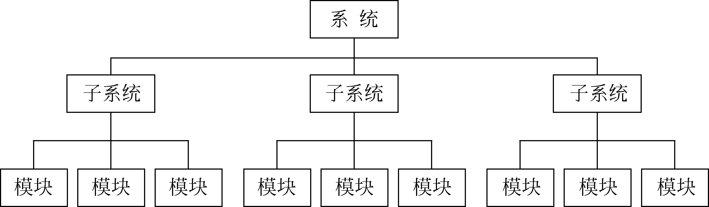
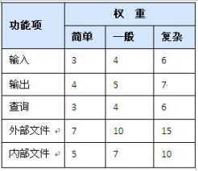

# 概述
>要进行成本控制，首先要进行成本估算。  
  
&ensp;&ensp;&ensp;&ensp;估算：是指通过预测构造软件项目所需要的工作量的过程。  

>估算进行越早，意义越大。估算进行越晚， 精度越高。

&ensp;&ensp;&ensp;&ensp;估算的基础：
- 历史数据
>在参考历史数据时需要考虑不同的环境。如编程语言，软件工具，复杂程度，标准和人员的经验。
- 工作度量
>直接计算真正的成本或时间是不可能的。编写相同的程序，不同的人将有显著的区别。
通常将工作量表达为如源代码的数量（LOC），或者千行代码量（KLOC）；或表达为功能点数（FP）。
- 复杂性
>相同KLOC的两个程序花费的时间将会不同，要根据复杂性进行修正，但是复杂性的度量通常是主观的

# 软件成本估算技术
&ensp;&ensp;&ensp;&ensp;软件规模是软件成本的主要因素，对软件规模的估计要从软件的分解开始。软件项目的设计有一个分层结构，这一分层结构就对应着工作分解结构（WBS）。如下图：
  
  
- 软件`规模`估算技术：`代码行（LOC）`、`功能点（FP）`、`计划评审技术（PERT）`。  
- 软件`成本`估算技术：类比、自顶向下、自底向上、专家判定、算法模型。  
- 常用成本估算模型：`COCOMO模型`、`COCOMOⅡ模型`和`Putnam模型`。  

## 代码行估算（LOC）
&ensp;&ensp;&ensp;&ensp;代码行（LOC）估算是最基本、最简单的软件规模估算方法，应用较普遍。LOC分为`无注释的源代码行`（NCLOC）和`注释的源代码行`（CLOC）。  
		LOC=NCLOC+CLOC  
>由于LOC单位比较小，在实际工作也常常使用KLOC（千代码行）来表示程序的长度。    

## 功能点方法（FP）
&ensp;&ensp;&ensp;&ensp;功能点方法（FP）是在需求分析阶段基于系统功能的一种规模估计方法，基本思想是：通过研究初始应用需求来确定各种`输入`、`输出`、`查询`、`外部文件`和`内部文件`的`数量`和`特性`，从而计算出`功能点`。  
&ensp;&ensp;&ensp;&ensp;常用情况：  
1.估计新的软件开发项目
2.应用软件包括很多输入输出或文件活动
3.拥有经验丰富的FP估算专家
4.拥有充分的数据资料，可以相当准确地将FP转化为LOC。  
		FP=UFC*TCF
>UFC:未调整功能点数。TCF：技术复杂度因子  
		UFC=功能项的加权和  
>功能项：`输入`、`输出`、`查询`、`外部文件`和`内部文件`。  

  

		TCF＝0.65*0.01(SUM（Ai）)  
>TCF的取值范围为0.65~1.35，分别对应着组成部分Ai都取值0到5  

## PERT估计  

		E＝（A+B）／2  
>A软件可能的最低规。B软件可能的最大规模。

## COCOMO模型

		E＝aS^b*EAF. 

>E是以人为单位的工作量。S是以KLOC计数的程序规模。EAF是一个工作量调整因子，在基本模型中取值1  

## Putnam模型

		S＝C×E^(1/3)×t^（4／3）

>S是以LOC为单位的源代码行数，C是技术因子，E是以人年为单位的工作量，t是以年为单位的耗费时间（直到产品交付所用的时间）。  

		C=S/(E^(1/3)×t^（4/3）)   
# 赢得值分析法

>赢得值（Earned Value，也称挣值或盈余值）分析法是一种全面衡量项目成本，进度的整体方法，以资金已经转化为项目成果的量来衡量，是一种完整和有效的项目监控指标和方法。  

## 项目预算和计划

## 收集实际成本

## 计算赢得值

## 成本／进度绩效

## 成本／进度控制